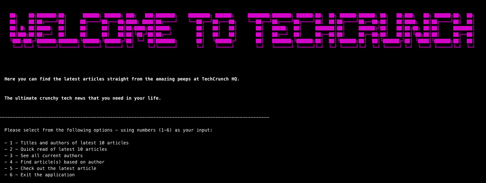
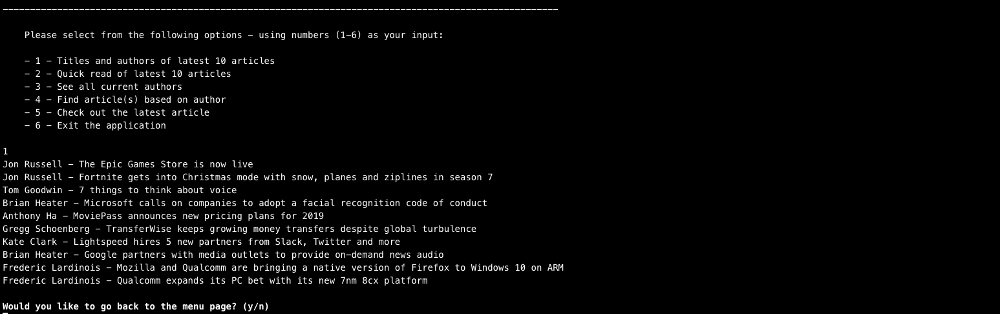
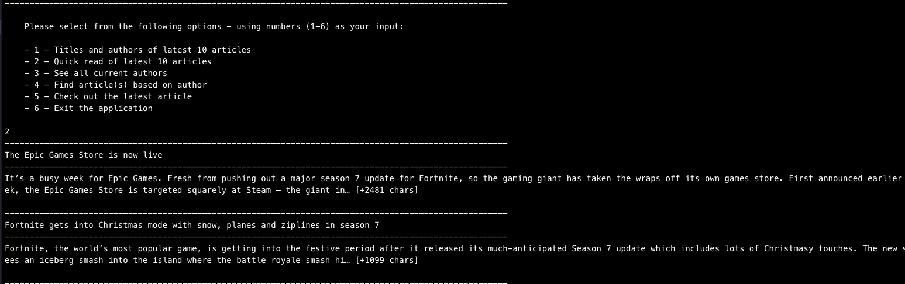
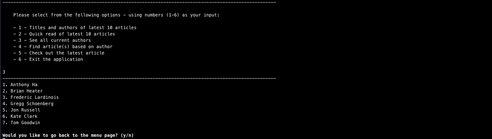
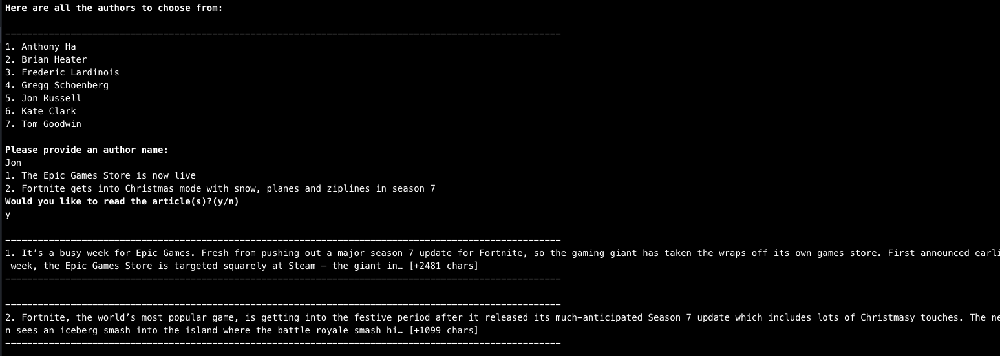
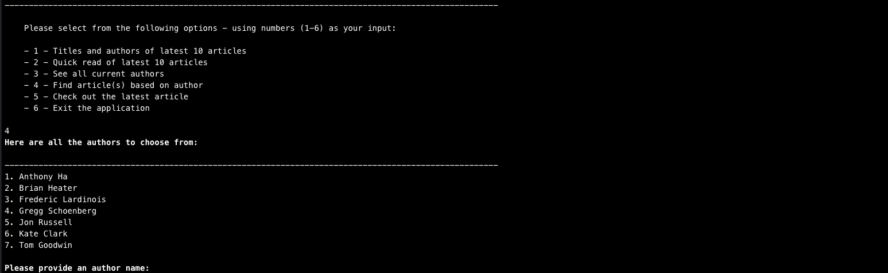
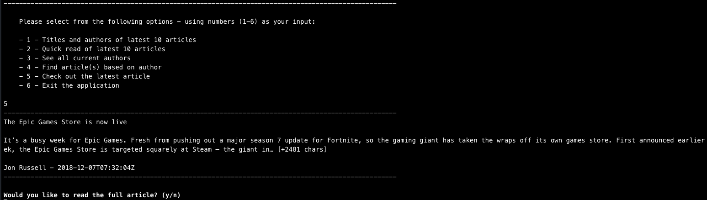
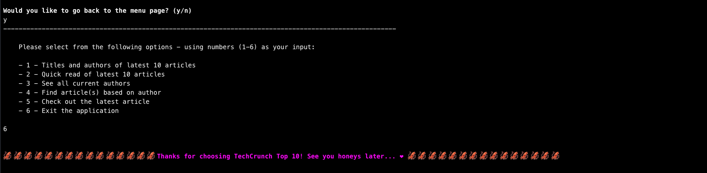

# 🗞 📰 TechCrunch Top 10 📰 🗞



## Using the TechCrunch API - Flatiron Module 1 Final Project
### About

TechCrunch Top Ten was created by [claudia95](https://github.com/claudia95) and [ja9-look](https://github.com/ja9-look).
The TechCruch API was called using Ruby, to obtain the top 10 articles on the TechCrunch News webpage.
This is a live API that updates the articles regularly so that readers will get hot-off-the-press news.

### MVP

We wanted our app to fulfill the following MVPs:

1. User should be able to see the latest article titles and authors
2. User should be able to have a brief overview of the latest articles
3. User should be able to see a unique list of authors
4. User should be able to see all articles under a specified author
5. User should be able to see the latest single article

### Stretch Goals

In order to further our app, we wanted to:

1. Ensure that the CLI is easy for the user to read
2. Implement emojis into the CLI
3. Use additional gems to make the app aesthetically pleasing
4. Allow the user to easily manoeuvre around the app

### API

[TechCrunch API](https://newsapi.org/v2/top-headlines?sources=techcrunch&apiKey=45aee5b7c7584064ac1b1de6297f5137)

### Gems
```
gem "sinatra-activerecord"
gem "sqlite3"
gem "pry"
gem "require_all"
gem 'rest-client'
gem 'json'
gem 'rainbow'
```

## Walkthrough

## Main Menu


## 1 - Titles and Authors



## 2 - Titles and Brief Content



## 3 - Unique List of Authors



## 4 - Search for Author and find Article(s)




## 5 - Latest article and link to view full article



## 6 - Exit App


